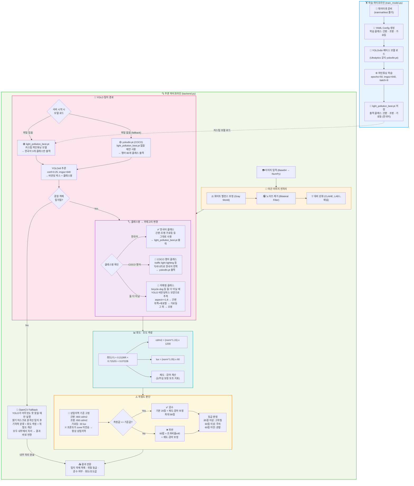

# 빛 공해 분석 시스템 — 전체 알고리즘 흐름도

```mermaid
flowchart TD
    subgraph TRAIN["🏋️ 학습 파이프라인 (train_model.py)"]
        T1["📁 데이터셋 준비\n(train/val/test 폴더)"]
        T2["📄 YAML Config 생성\n학습 클래스: 간판 · 조명 · 가로등"]
        T3["🤖 YOLOv8n 베이스 모델 로드\n(Ultralytics 공식 yolov8n.pt)"]
        T4["⚙️ 파인튜닝 학습\nepochs=50, imgsz=640, batch=8"]
        T5["💾 light_pollution_best.pt 저장\n출력 클래스: 간판 · 조명 · 가로등 (한국어)"]
        T1 --> T2 --> T3 --> T4 --> T5
    end

    subgraph INFER["🔍 추론 파이프라인 (backend.py)"]
        I1["📷 이미지 입력 (Base64 → NumPy)"]

        subgraph PRE["🎨 야간 이미지 전처리"]
            P1["⚖️ 화이트 밸런스 보정 (Gray World)"]
            P2["🔇 노이즈 제거 (Bilateral Filter)"]
            P3["💡 대비 강화 (CLAHE, LAB L채널)"]
            P1 --> P2 --> P3
        end

        subgraph YOLO_PATH["🤖 YOLO 탐지 경로"]
            DM{"서버 시작 시\n모델 로드"}
            D1A["🟢 light_pollution_best.pt\n커스텀 파인튜닝 모델\n→ 한국어 3개 클래스만 출력"]
            D1B["🟡 yolov8n.pt (COCO)\nlight_pollution_best.pt 없을 때만 사용\n→ 영어 80개 클래스 출력"]
            D1["YOLOv8 추론\nconf=0.25, imgsz=640\n→ 바운딩 박스 + 클래스명"]
            D2{"광원 객체\n탐지됨?"}
            DM -->|"파일 있음"| D1A
            DM -->|"파일 없음 (fallback)"| D1B
            D1A & D1B --> D1 --> D2

            subgraph CLS["🏷️ 클래스명 → 카테고리 변환"]
                C1{"클래스명 확인"}
                C2["✅ 한국어 클래스\n간판·조명·가로등 등\n그대로 사용\n← light_pollution_best.pt 출력"]
                C3["🔄 COCO 영어 클래스\ntraffic light·lighting 등\n딕셔너리로 한국어 번역\n← yolov8n.pt 출력"]
                C4["📐 미매핑 클래스\nbicycle·dog 등 둘 다 아닐 때\nYOLO 바운딩박스 모양으로 추측\naspect>=1.8 → 간판\n위쪽+세로형 → 가로등\n그 외 → 조명"]
                C1 -->|"한국어"| C2
                C1 -->|"COCO 영어"| C3
                C1 -->|"둘 다 아님"| C4
            end
            D2 -->|"Yes"| CLS
        end

        CV["🔦 OpenCV Fallback\nYOLO가 아무것도 못 찾을 때만 실행\n밝기 마스크로 윤곽선 탐지 후\n기하학 분류 + 휘도 측정 + 위험도 계산\n모두 내부에서 처리 → 결과 바로 반환"]

        subgraph METRICS["📊 휘도 · 조도 측정"]
            M1["휘도(Y) = 0.2126R + 0.7152G + 0.0722B"]
            M2["cd/m2 = (norm^1.15) x 1200"]
            M3["lux = (norm^1.05) x 60"]
            M4["채도 · 감마 계산\n(눈부심 보정 보조 지표)"]
            M1 --> M2
            M1 --> M3
            M1 --> M4
        end

        subgraph RISK["⚠️ 위험도 판단"]
            R0["🏢 상업지역 기준 고정\n간판: 800 cd/m2\n조명: 650 cd/m2\n가로등: 30 lux\n※ 프론트가 zone 미전송 → 항상 상업지역"]
            R1{"측정값 <= 기준값?"}
            R2["✅ 준수\n기본 20점 + 채도·감마 보정\n최대 58점"]
            R3["❌ 위반\n60점 + 초과비율x40\n+ 채도·감마 보정"]
            R4["등급 판정\n85점 이상: 고위험\n60점 이상: 주의\n60점 미만: 관찰"]
            R0 --> R1
            R1 -->|"Yes"| R2
            R1 -->|"No"| R3
            R2 --> R4
            R3 --> R4
        end

        OUT["📤 결과 반환\n탐지 객체 목록 · 위험 등급 · 준수 여부 · 휘도/조도값"]

        I1 --> PRE --> YOLO_PATH
        D2 -->|"No"| CV
        CLS --> METRICS --> RISK --> OUT
        CV -->|"내부 처리 완료"| OUT
    end

    T5 -.->|"커스텀 모델 로드"| D1A

    style TRAIN fill:#e8f4fd,stroke:#2196F3,stroke-width:2px
    style INFER fill:#f1f8e9,stroke:#4CAF50,stroke-width:2px
    style PRE fill:#fff3e0,stroke:#FF9800,stroke-width:1.5px
    style YOLO_PATH fill:#fce4ec,stroke:#E91E63,stroke-width:1.5px
    style CLS fill:#f3e5f5,stroke:#9C27B0,stroke-width:1.5px
    style METRICS fill:#e0f2f1,stroke:#009688,stroke-width:1.5px
    style RISK fill:#fff8e1,stroke:#FF6F00,stroke-width:1.5px
```
